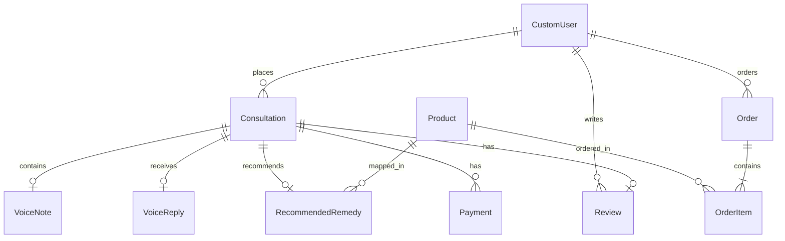

# Astrology Consultation Platform — Database Schema

This document details the PostgreSQL relational database schema for the Astrology Consultation Platform, implemented via Django's Object-Relational Mapper (ORM).

---

## 1. Entity Relationship Overview

---

## 2. Table Definitions

### 2.1. `users_customuser` (CustomUser)
Inherits from Django's `AbstractUser` and extends it with phone number, profile photo, and passwordless OTP verification columns.

| Field Name | Django Field Type | DB Data Type | Constraints & Defaults | Description |
| :--- | :--- | :--- | :--- | :--- |
| `id` | `AutoField` | `INTEGER` | `PRIMARY KEY`, `AUTO_INCREMENT` | Unique identifier |
| `email` | `EmailField` | `VARCHAR(254)` | `UNIQUE`, `NOT NULL` | User email (used for primary login) |
| `username` | `CharField` | `VARCHAR(150)` | `UNIQUE`, `NOT NULL` | Required by Django backend |
| `password` | `CharField` | `VARCHAR(128)` | `NOT NULL` | Hashed password |
| `phone_number`| `CharField` | `VARCHAR(15)` | `UNIQUE`, `NULL` | User's phone number for OTP auth |
| `is_astrologer`| `BooleanField` | `BOOLEAN` | `DEFAULT FALSE` | True if the user is an astrologer |
| `is_staff` | `BooleanField` | `BOOLEAN` | `DEFAULT FALSE` | Required for admin portal access |
| `otp_code` | `CharField` | `VARCHAR(6)` | `NULL`, `BLANK` | Temporary SMS verification OTP |
| `otp_expiry` | `DateTimeField` | `TIMESTAMP WITH TZ` | `NULL` | Expiration time of `otp_code` (10m duration) |
| `profile_photo`| `URLField` | `VARCHAR(200)` | `BLANK` | Cloudinary URL for profile picture |
| `created_at` | `DateTimeField` | `TIMESTAMP WITH TZ` | `AUTO_NOW_ADD` | Timestamp of registration |
| `updated_at` | `DateTimeField` | `TIMESTAMP WITH TZ` | `AUTO_NOW` | Last modified timestamp |

### 2.2. `consultations_consultation` (Consultation)
Core table tracking the user's birth data, description of their query, payment amount, and progress status.

| Field Name | Django Field Type | DB Data Type | Constraints & Defaults | Description |
| :--- | :--- | :--- | :--- | :--- |
| `id` | `AutoField` | `INTEGER` | `PRIMARY KEY` | Unique consultation request ID |
| `user_id` | `ForeignKey` | `INTEGER` | `FK (users_customuser)`, `ON DELETE CASCADE` | Link to the requesting user |
| `date_of_birth`| `DateField` | `DATE` | `NOT NULL` | Client's birth date |
| `birth_time` | `TimeField` | `TIME` | `NOT NULL` | Client's birth time |
| `birth_place` | `CharField` | `VARCHAR(200)` | `NOT NULL` | City and country of birth |
| `problem_desc` | `TextField` | `TEXT` | `NOT NULL` | User-submitted details of problems/questions |
| `status` | `CharField` | `VARCHAR(20)` | `DEFAULT 'pending'`, `CHOICES` | Lifecycle status: `pending`, `paid`, `in_review`, `replied`, `closed` |
| `amount_paid` | `DecimalField` | `NUMERIC(10,2)` | `NULL` | Final transaction fee amount |
| `created_at` | `DateTimeField` | `TIMESTAMP WITH TZ` | `AUTO_NOW_ADD` | Date consultation was submitted |
| `updated_at` | `DateTimeField` | `TIMESTAMP WITH TZ` | `AUTO_NOW` | Date consultation was last updated |

### 2.3. `consultations_voicenote` (VoiceNote)
User's uploaded audio problem descriptions.

| Field Name | Django Field Type | DB Data Type | Constraints & Defaults | Description |
| :--- | :--- | :--- | :--- | :--- |
| `id` | `AutoField` | `INTEGER` | `PRIMARY KEY` | Unique ID |
| `consultation_id` | `ForeignKey` | `INTEGER` | `FK (consultations_consultation)`, `ON DELETE CASCADE` | Associated consultation request |
| `file_url` | `URLField` | `VARCHAR(200)` | `NOT NULL` | Cloudinary secure CDN URL |
| `duration` | `IntegerField` | `INTEGER` | `NULL` | Optional audio duration in seconds |
| `created_at` | `DateTimeField` | `TIMESTAMP WITH TZ` | `AUTO_NOW_ADD` | Upload timestamp |

### 2.4. `consultations_voicereply` (VoiceReply)
Astrologer's audio responses.

| Field Name | Django Field Type | DB Data Type | Constraints & Defaults | Description |
| :--- | :--- | :--- | :--- | :--- |
| `id` | `AutoField` | `INTEGER` | `PRIMARY KEY` | Unique ID |
| `consultation_id` | `ForeignKey` | `INTEGER` | `FK (consultations_consultation)`, `ON DELETE CASCADE` | Associated consultation request |
| `astrologer_id` | `ForeignKey` | `INTEGER` | `FK (users_customuser)`, `ON DELETE SET NULL` | Astrologer who answered |
| `file_url` | `URLField` | `VARCHAR(200)` | `NOT NULL` | Cloudinary secure CDN URL |
| `duration` | `IntegerField` | `INTEGER` | `NULL` | Audio duration in seconds |
| `created_at` | `DateTimeField` | `TIMESTAMP WITH TZ` | `AUTO_NOW_ADD` | Answer timestamp |

### 2.5. `inventory_product` (Product)
The catalog of Rudraksh beads and other recommendation items.

| Field Name | Django Field Type | DB Data Type | Constraints & Defaults | Description |
| :--- | :--- | :--- | :--- | :--- |
| `id` | `AutoField` | `INTEGER` | `PRIMARY KEY` | Product ID |
| `name` | `CharField` | `VARCHAR(200)` | `UNIQUE`, `NOT NULL` | Product name (e.g. "5 Mukhi Rudraksh") |
| `description` | `TextField` | `TEXT` | `BLANK` | Product detail and benefits |
| `price` | `DecimalField` | `NUMERIC(10,2)` | `NOT NULL` | Purchase price (INR) |
| `stock_count` | `IntegerField` | `INTEGER` | `DEFAULT 0` | Quantity available in inventory |
| `image_url` | `URLField` | `VARCHAR(200)` | `BLANK` | Image URL stored in Cloudinary |
| `is_active` | `BooleanField` | `BOOLEAN` | `DEFAULT TRUE` | If false, hidden from catalogs |
| `created_at` | `DateTimeField` | `TIMESTAMP WITH TZ` | `AUTO_NOW_ADD` | Inventory creation timestamp |

### 2.6. `consultations_remedy` (RecommendedRemedy)
Link between the astrologer's recommendation and catalog inventory items.

| Field Name | Django Field Type | DB Data Type | Constraints & Defaults | Description |
| :--- | :--- | :--- | :--- | :--- |
| `id` | `AutoField` | `INTEGER` | `PRIMARY KEY` | Unique ID |
| `consultation_id` | `ForeignKey` | `INTEGER` | `FK (consultations_consultation)`, `ON DELETE CASCADE` | Related consultation reference |
| `product_id` | `ForeignKey` | `INTEGER` | `FK (inventory_product)`, `ON DELETE PROTECT` | Recommended catalog product |
| `instructions` | `TextField` | `TEXT` | `BLANK` | Wear instructions, timings, or mantras |
| `created_at` | `DateTimeField` | `TIMESTAMP WITH TZ` | `AUTO_NOW_ADD` | Time recommended |

### 2.7. `payments_payment` (Payment)
Tracks transactions and Razorpay metadata details.

| Field Name | Django Field Type | DB Data Type | Constraints & Defaults | Description |
| :--- | :--- | :--- | :--- | :--- |
| `id` | `AutoField` | `INTEGER` | `PRIMARY KEY` | Unique ID |
| `user_id` | `ForeignKey` | `INTEGER` | `FK (users_customuser)`, `ON DELETE CASCADE` | Paying user |
| `consultation_id` | `ForeignKey` | `INTEGER` | `FK (consultations_consultation)`, `ON DELETE CASCADE` | Related consultation reference |
| `razorpay_order_id`| `CharField` | `VARCHAR(100)`| `UNIQUE`, `NOT NULL` | Razorpay order ID |
| `razorpay_payment_id`|`CharField` | `VARCHAR(100)`| `UNIQUE`, `NULL` | Razorpay checkout payment ID |
| `razorpay_signature`|`CharField` | `VARCHAR(200)`| `NULL` | Razorpay verification signature |
| `amount` | `DecimalField` | `NUMERIC(10,2)` | `NOT NULL` | Payment amount in INR |
| `status` | `CharField` | `VARCHAR(20)` | `DEFAULT 'initiated'`, `CHOICES`| Status: `initiated`, `captured`, `failed`, `refunded` |
| `created_at` | `DateTimeField` | `TIMESTAMP WITH TZ` | `AUTO_NOW_ADD` | Transaction timestamp |
| `updated_at` | `DateTimeField` | `TIMESTAMP WITH TZ` | `AUTO_NOW` | Last status update |

### 2.8. `orders_order` (Order)
Purchase orders placed (usually triggered via WhatsApp routing and final checkout verification).

| Field Name | Django Field Type | DB Data Type | Constraints & Defaults | Description |
| :--- | :--- | :--- | :--- | :--- |
| `id` | `AutoField` | `INTEGER` | `PRIMARY KEY` | Unique order ID |
| `user_id` | `ForeignKey` | `INTEGER` | `FK (users_customuser)`, `ON DELETE PROTECT` | User who bought |
| `status` | `CharField` | `VARCHAR(20)` | `DEFAULT 'received'`, `CHOICES`| Statuses: `received`, `packed`, `shipped`, `delivered` |
| `total_amount` | `DecimalField` | `NUMERIC(10,2)` | `NOT NULL` | Total order amount in INR |
| `shipping_address`| `TextField` | `TEXT` | `NOT NULL` | Full delivery address |
| `tracking_number` | `CharField` | `VARCHAR(100)`| `NULL`, `BLANK` | Shipping courier tracking ID |
| `created_at` | `DateTimeField` | `TIMESTAMP WITH TZ` | `AUTO_NOW_ADD` | Order creation date |
| `updated_at` | `DateTimeField` | `TIMESTAMP WITH TZ` | `AUTO_NOW` | Last modified date |

### 2.9. `orders_orderitem` (OrderItem)
Line items for remedy orders.

| Field Name | Django Field Type | DB Data Type | Constraints & Defaults | Description |
| :--- | :--- | :--- | :--- | :--- |
| `id` | `AutoField` | `INTEGER` | `PRIMARY KEY` | Item ID |
| `order_id` | `ForeignKey` | `INTEGER` | `FK (orders_order)`, `ON DELETE CASCADE` | Associated order record |
| `product_id` | `ForeignKey` | `INTEGER` | `FK (inventory_product)`, `ON DELETE PROTECT` | Catalog item purchased |
| `quantity` | `IntegerField` | `INTEGER` | `DEFAULT 1` | Quantity ordered |
| `price` | `DecimalField` | `NUMERIC(10,2)` | `NOT NULL` | Price per item at purchase time |

### 2.10. `reviews_review` (Review)
Customer testimonials and rating stars.

| Field Name | Django Field Type | DB Data Type | Constraints & Defaults | Description |
| :--- | :--- | :--- | :--- | :--- |
| `id` | `AutoField` | `INTEGER` | `PRIMARY KEY` | Review ID |
| `user_id` | `ForeignKey` | `INTEGER` | `FK (users_customuser)`, `ON DELETE CASCADE` | Reviewing client |
| `consultation_id` | `ForeignKey` | `INTEGER` | `FK (consultations_consultation)`, `ON DELETE SET NULL`, `NULL` | Optional link to consultation |
| `rating` | `IntegerField` | `INTEGER` | `NOT NULL`, `CHECK (1 <= rating <= 5)`| 1 to 5 star rating |
| `comment` | `TextField` | `TEXT` | `BLANK` | Feedback text review |
| `is_approved` | `BooleanField` | `BOOLEAN` | `DEFAULT FALSE` | Moderation approval status |
| `created_at` | `DateTimeField` | `TIMESTAMP WITH TZ` | `AUTO_NOW_ADD` | Submission date |
