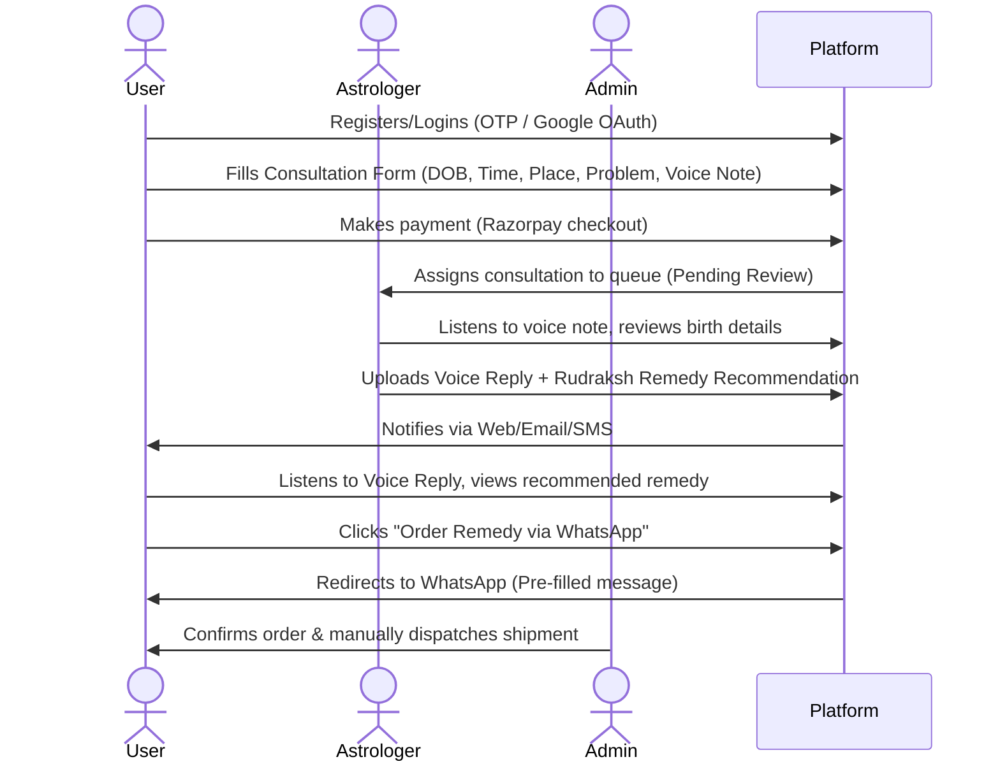

# AstroRemedy — Product Requirements Document (PRD)

**Version:** 1.0 (MVP)  
**Status:** Approved  
**Author:** Product & Architecture Team  
**Date:** June 2, 2026  

---

## 1. Project Overview & Vision

AstroRemedy is a trust-first, mobile-responsive web platform designed to connect users (Seekers) with professional, certified Vedic astrologers (Seers). The goal of the platform is to offer personalized, empathetic birth chart analyses via voice-recorded responses and facilitate the purchase of authentic Rudraksh remedies.

The platform is optimized for a rapid, low-friction user flow, utilizing passwordless SMS OTP login, Google OAuth, and quick WhatsApp-based remedy checkout.

### Core Business Workflow

---

## 2. Key Success Factors (KSFs) & Metrics

To deliver a premium, trust-first experience, the MVP must succeed across the following metrics:
- **Speed of Turnaround:** Target consultation responses delivered by astrologers within 24–48 hours of submission.
- **Seeker Trust Indicators:** Clear displays of certified credentials, transparent transaction history, and verified seeker testimonials on the landing page.
- **Genuine Remedy Deliveries:** High-quality, authenticated Rudraksh beads with visible tracking numbers.
- **Frictionless UX:** Simple step-by-step form → payment → response loop, optimized for mobile devices.

---

## 3. User Roles & Permissions

| Role | Permissions & Capabilities |
| :--- | :--- |
| **Seeker (Client)** | Register, request consultation, pay via Razorpay, upload voice intake, view status/history, play astrologer replies, order remedy products via WhatsApp, and submit reviews. |
| **Seer (Astrologer)**| View paid/in-review consultation queues, play client voice notes, upload voice replies, select remedy recommendations from catalog, add wearing instructions, and update consultation status. |
| **Administrator** | Manage product inventory (stock counts, pricing), moderate and approve user reviews/testimonials, update shipping tracking numbers for remedy orders, and view platform metrics. |

---

## 4. Functional Requirements

### 4.1. Authentication & Onboarding
- **Passwordless Mobile Login:** Secure login/registration via mobile number using SMS verification codes (OTP). Includes a Master Bypass Code (`123456`) in non-production environments for verification.
- **Google Social Sign-in:** Standard OAuth2 social authentication using Google accounts.
- **Current User Profile:** Retrieval and modification of basic account details including username, phone number, and Cloudinary-stored profile photographs.

### 4.2. Consultation Lifecycle
- **Consultation Intake Form:** Captures precise birth data:
  - Date of Birth (YYYY-MM-DD)
  - Time of Birth (HH:MM, 24-hour style)
  - Place of Birth (City, Country text input)
  - Detailed Problem Description (Textarea)
- **Voice Intake Recording:** Users can record a voice note directly using their device's microphone or upload an audio file (up to 10MB, supporting MP3/WAV/OGG) describing their planetary or personal concerns.
- **Razorpay Checkout Integration:**
  - Secure payments in INR.
  - The consultation remains in a `pending` state until the Razorpay checkout transaction is completed.
  - Server-side signature verification is executed to prevent payment spoofing before transitioning state to `paid`.
- **Status State Transitions:**
  - `pending`: Awaiting transaction verification.
  - `paid`: Payment verified, queued in the astrologer console.
  - `in_review`: Astrologer has opened the consultation and is analyzing the chart coordinates.
  - `replied`: Astrologer has delivered the voice response and recommended remedies.
  - `closed`: Process completed.

### 4.3. Astrologer Portal & Response System
- **Interactive Queue Management:** Tabbed views splitting consultations into `Paid Inquiries` (awaiting review), `Analyzing` (in-review), and `Replied` (completed).
- **Integrated Microphone Recorder:** Astrologers can record a high-fidelity voice reply directly inside the browser or upload an audio file.
- **Remedy Prescription selector:** A grid checklist of catalog products allowing astrologers to select and tag recommended Rudraksh beads along with custom text fields for wearing instructions, mantras, and timings.

### 4.4. Remedy Catalog & WhatsApp Checkout
- **WhatsApp Order Redirection:** Generates pre-filled WhatsApp links containing the recommended item, user information, and consultation reference. Clicking the "Order via WhatsApp" button routes users directly to a secure chat window with support.
- **Order Tracking:** Allows users to track their manual shipments through four key phases: `received` → `packed` → `shipped` (with DTDC tracking number) → `delivered`.
- **Catalog Inventory:** Back-office registry of available remedy products displaying descriptions, pricing in INR, image resources, stock counts, and visibility toggles.

### 4.5. Admin Moderation & Testimonials
- **Review Moderation Panel:** Admins must review and approve client testimonials before they can appear publicly on the landing page carousel.

---

## 5. Technical & Non-Functional Requirements (NFRs)

- **Security & Authorization:** JWT (JSON Web Tokens) are used to protect all backend endpoints. Access tokens are passed in the `Authorization` header.
- **Audio Processing:** Media assets are stored securely on Cloudinary. The database holds only metadata and secure Cloudinary CDN URLs.
- **Async Execution:** Celery workers backed by a Redis message broker handle out-of-band actions (sending SMS OTPs, dispatching email notifications, and updating tracking hooks).
- **Performance & Loading:** Frontend utilizes a client-side hydration block (`Hydration.tsx`) with pre-render gate spinners to prevent React hydration mismatches while state loads.
- **Telemetry & Monitoring:** System errors, exceptions, and payment verification anomalies are logged and tracked via Sentry.

---

## 6. Key API Endpoints Reference

### Authentication
- `POST /api/auth/register/` — Register client account
- `POST /api/auth/send-otp/` — Generate SMS OTP code
- `POST /api/auth/verify-otp/` — Verify OTP code and return JWT
- `POST /api/auth/google/` — Google OAuth exchange
- `GET/PATCH /api/auth/me/` — Retrieve/Update user profile details

### Consultations
- `GET /api/consultations/` — User or Astrologer list inquiries
- `POST /api/consultations/` — Submit new consultation details
- `POST /api/consultations/{id}/upload-voice/` — Upload user voice note file to Cloudinary
- `PATCH /api/consultations/{id}/status/` — Update status state (e.g. `in_review`)
- `POST /api/consultations/{id}/reply/` — Submit astrologer voice reply and remedy selection

### Payments & Orders
- `POST /api/payments/create-order/` — Initiate Razorpay transaction ID
- `POST /api/payments/verify/` — Secure signature verification
- `GET /api/orders/` — List seeker order history and tracking
- `GET /api/orders/whatsapp-link/` — Fetch pre-filled wa.me URL for remedy purchase

---

## 7. Future Product Enhancements (Post-MVP)

- **Real-Time Text Chat:** Direct messaging channels between users and assigned astrologers after advice delivery for follow-up questions.
- **Video Kundli Consultations:** Scheduling system for live video consultations.
- **AI Kundli Summary Generator:** Automatic generation of general charts based on birth coordinates prior to astrologer review to provide instant user feedback.
- **Native Mobile Apps:** Android and iOS apps with push notifications for status updates (e.g. "Response Ready").
