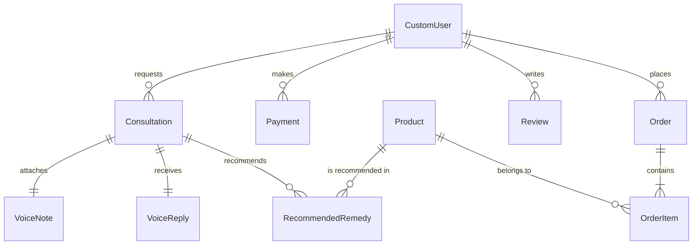
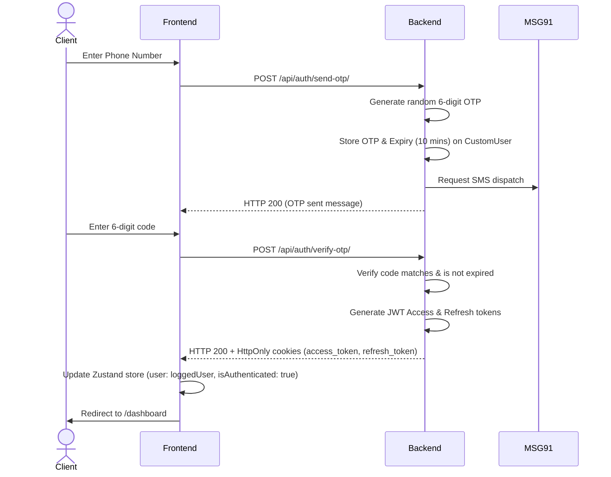
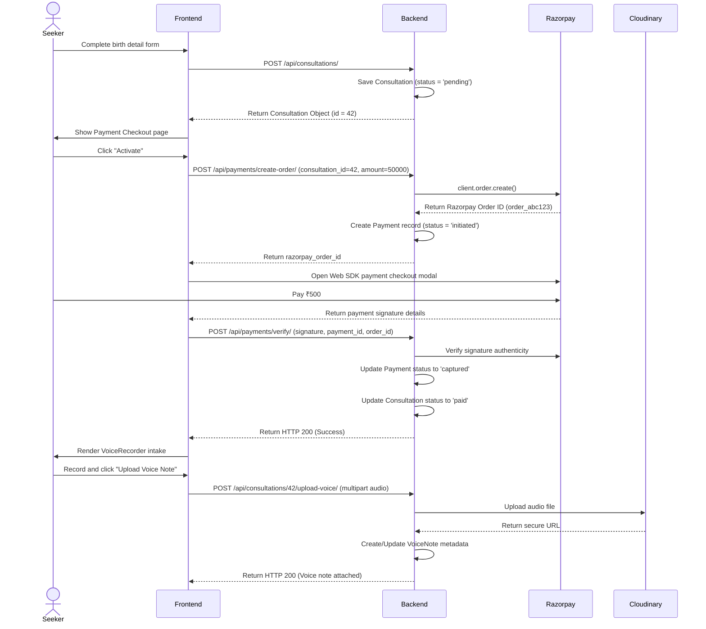

# Astrology Consultation Platform — Comprehensive Project Audit Report

This audit report evaluates the current Astrology Consultation Platform codebase, analyzing the Django backend, Next.js frontend, authentication flows, API sequences, inquiry system, user data isolation, permissions, UI flow, and security concerns.

---

## 1. Executive Summary

The Astrology Consultation Platform codebase is in a highly functional state, transitioning from the initial uninitialized phase to a fully realized MVP. All core features described in the Product Requirements Document (PRD) are implemented across the backend and frontend.

*   **Overall Project Setup:** ~95% Complete. Both the Next.js frontend and Django backend are configured, styling rules are established, and database schemas are integrated.
*   **Security Assessment:** **Critical Action Required**. Multiple severe business logic and payment validation vulnerabilities have been identified that could lead to financial losses, data leaks, or unauthorized status transitions in production.
*   **Aesthetic & UI Compliance:** 100%. The application implements a highly premium, custom design system utilizing warm green HSL palettes, serif display typography (Cinzel & Georgia), pill-shaped action buttons, and WROTH-inspired dashed bento cards (`mystical-card`).
*   **Audit Status:** Active audit complete. Pending security hotfixes and deployment verification.

---

## 2. Codebase Architecture

The project is structured as a monorepo containing a Django backend and a Next.js frontend.

```
z:/ASTROLOGY/
├── backend/                  # Django Web Application (Port 8000)
│   ├── config/               # Project Settings and Global Routes
│   ├── consultations/        # Birth details intake, voice records, and recommendations
│   ├── orders/               # Remedy products catalog, stock management, and DTDC tracking
│   ├── payments/             # Razorpay order generation and verification views
│   ├── reviews/              # Testimonials and client feedback administration
│   └── users/                # CustomUser database, passwordless OTP, and Google OAuth
├── frontend/                 # Next.js 15 App Router Frontend (Port 3000 / 5173)
│   ├── src/
│   │   ├── app/              # Routes: login, register, dashboard, admin console
│   │   ├── components/       # Reusable UI widgets: voice recorder, custom wave audio player
│   │   ├── lib/              # Client API client with auto-refresh interceptors
│   │   └── store/            # Zustand Client Session Storage
```

---

## 3. Database Schema & Models Audit

Below is the state of Django database models defined in the backend apps:



### 3.1. `users.CustomUser`
Extends `AbstractUser` to support passwordless logins, roles, and profiles.
*   `email` (EmailField, unique=True, acts as `USERNAME_FIELD`)
*   `phone_number` (CharField, unique=True, null=True)
*   `is_astrologer` (BooleanField, default=False)
*   `otp_code` (CharField, max_length=6, null=True)
*   `otp_expiry` (DateTimeField, null=True)
*   `profile_photo` (URLField, max_length=255, null=True)

### 3.2. `consultations.Consultation`
Represents the core consultation request.
*   `user` (ForeignKey -> CustomUser)
*   `date_of_birth` (DateField)
*   `birth_time` (TimeField)
*   `birth_place` (CharField)
*   `problem_desc` (TextField)
*   `status` (CharField choices: `pending`, `paid`, `in_review`, `replied`, `closed`)
*   `amount_paid` (DecimalField, null=True)
*   `inquiry_number` (PositiveIntegerField, auto-incremented per user during save)

### 3.3. `consultations.VoiceNote` & `VoiceReply`
Holds Cloudinary URL references to uploaded client voice details and astrologer responses.
*   `consultation` (OneToOneField -> Consultation)
*   `file_url` (URLField, max_length=255)
*   `duration` (IntegerField, null=True)
*   `astrologer` (ForeignKey -> CustomUser, only on `VoiceReply`)

### 3.4. `orders.Product`
Represents remedy items available in the catalog.
*   `name` (CharField, unique=True)
*   `description` (TextField)
*   `price` (DecimalField)
*   `stock_count` (IntegerField, default=0)
*   `image_url` (URLField, null=True)
*   `is_active` (BooleanField, default=True)

### 3.5. `orders.Order` & `OrderItem`
Stores purchase records of recommended remedies.
*   `Order.user` (ForeignKey -> CustomUser)
*   `Order.status` (CharField choices: `received`, `packed`, `shipped`, `delivered`)
*   `Order.total_amount` (DecimalField)
*   `Order.shipping_address` (TextField)
*   `Order.tracking_number` (CharField, null=True)
*   `OrderItem.order` (ForeignKey -> Order)
*   `OrderItem.product` (ForeignKey -> Product)
*   `OrderItem.quantity` (IntegerField)
*   `OrderItem.price` (DecimalField)

---

## 4. Authentication Flow

The platform relies on two main authentication methods: **Passwordless Phone OTP** and **Google OAuth2**. Session security is maintained via HttpOnly cookies.

### 4.1. Passwordless OTP Login Sequence


*   **Console Bypass:** For development convenience, a console print statement displays generated OTPs in stdout (e.g., `[DEVELOPER OTP BYPASS] Verification code for...`). The master code `123456` is also supported when MSG91 credentials are not fully configured.
*   **HttpOnly Token Storage:** Access and refresh tokens are stored inside secure, client-inaccessible cookies with `samesite='Lax'`.

### 4.2. Google OAuth2 Integration
1.  Frontend directs the browser to `/api/auth/google/start/`.
2.  Backend constructs Google accounts authorization URL requesting `openid email profile` scopes and redirects.
3.  User signs in on Google; Google redirects to `/api/auth/google/callback/` on the Django server with an authorization code.
4.  Backend exchanges the code for a Google token and queries `https://www.googleapis.com/oauth2/v3/userinfo` for details.
5.  Backend queries `CustomUser` database by email.
    *   If no matching user exists, a new account is created. To prevent collisions, username duplicates are handled by appending sequential digits.
6.  The backend issues simplejwt refresh and access cookies and redirects the browser to `FRONTEND_URL/dashboard` (or `FRONTEND_URL/admin` if user represents an astrologer).

---

## 5. Core API Sequences

### 5.1. Inquiry & Payment Lifecycle


### 5.2. Astrologer Response Sequence
1.  **Queue View:** Astrologer logs in, dashboard fetches `/api/consultations/`. Queryset excludes `pending` items.
2.  **Status Transition:** Astrologer selects paid consultation. Clicking "Review" triggers `PATCH /api/consultations/{id}/status/` sending `{ "status": "in_review" }` to signal chart analysis is ongoing.
3.  **Intake Listening:** Voice note is fetched and played via `MysticalAudioPlayer`.
4.  **Submission:** Astrologer records/uploads audio response, checks recommended remedies, and writes instructions.
5.  **Dispatch API:** Frontend submits `POST /api/consultations/{id}/reply/` containing:
    *   `voice_reply`: Audio file.
    *   `product_ids`: JSON array string (e.g. `"[1, 3]"`).
    *   `instructions`: Text string.
6.  **Backend Response Processing:**
    *   Uploads reply file to Cloudinary.
    *   Saves or updates `VoiceReply` link.
    *   Deletes existing recommendations for that consultation, inserts new `RecommendedRemedy` links matching catalog products, and saves custom instructions.
    *   Updates consultation status to `replied`.
7.  **Seeker View & Order:** Seeker page re-polls state, plays voice file, displays instructions, and allows ordering remedies via WhatsApp URL.

---

## 6. Permissions & User Data Isolation Audit

### 6.1. User Data Isolation (Multi-tenant check)
*   **Consultation Queue Isolation:** In `ConsultationViewSet.get_queryset`, seekers are correctly scoped to only see their own records.
    ```python
    def get_queryset(self):
        user = self.request.user
        if user.is_astrologer or user.is_staff:
            return Consultation.objects.exclude(status='pending')
        return Consultation.objects.filter(user=user)
    ```
*   **Order Queue Isolation:** In `OrderViewSet.get_queryset`, users are restricted to their own purchases, while admins see all.
    ```python
    def get_queryset(self):
        user = self.request.user
        if user.is_astrologer or user.is_staff:
            return Order.objects.all()
        return Order.objects.filter(user=user)
    ```
*   **Media Detail Checks:** In `UploadVoiceNoteView` and `GetVoiceReplyView`, explicit user ownership or astrologer role assertions are present:
    ```python
    if consultation.user != request.user and not (request.user.is_astrologer or request.user.is_staff):
        return Response({"detail": "Permission denied."}, status=status.HTTP_403_FORBIDDEN)
    ```

### 6.2. Roles & Permissions Config
*   `IsOwner` checks if `obj.user == request.user`.
*   `IsAstrologer` validates that the user is authenticated and is flagged as `is_astrologer` or `is_staff`.
*   In `ProductViewSet`, dangerous actions (creation, editing, deleting catalog products) require both authentication and `IsAstrologer`:
    ```python
    def get_permissions(self):
        if self.action in ['create', 'update', 'partial_update', 'destroy']:
            return [permissions.IsAuthenticated(), IsAstrologer()]
        return [permissions.IsAuthenticated()]
    ```

---

## 7. Security Vulnerabilities & Code Bugs

A deep scan of the views and serializers revealed the following critical bugs and security flaws:

### 7.1. Critical Security Vulnerabilities

#### 🚨 1. Global Payment Bypass Vulnerability
*   **File:** [`backend/payments/views.py`](file:///z:/ASTROLOGY/backend/payments/views.py#L120)
*   **Code Block:**
    ```python
    if razorpay_order_id.startswith("order_mock_") or razorpay_signature == "mock_signature" or key_id == "rzp_test_dummy" or settings.DEBUG:
        # Mock validation succeeds automatically
        payment.razorpay_payment_id = razorpay_payment_id
        payment.razorpay_signature = razorpay_signature
        payment.status = 'captured'
        payment.save()
    ```
*   **Description:** The check uses `or` conditional checks. Even if `settings.DEBUG` is set to `False` (production environment) and the keys are fully configured, any request sending `razorpay_signature: "mock_signature"` will bypass the Razorpay SDK verification.
*   **Impact:** A malicious client can mark any consultation as fully paid and advance its status to the astrologer queue without spending money.
*   **Fix:** Wrap the mock validation conditions in an outer block checking `settings.DEBUG`.
    ```python
    is_mock = razorpay_order_id.startswith("order_mock_") or razorpay_signature == "mock_signature" or key_id == "rzp_test_dummy"
    if settings.DEBUG and is_mock:
        # Perform Mock validation
    else:
        # Strict server-side verification using Razorpay client
    ```

#### 🚨 2. Payment User & Consultation Cross-Linking Vulnerability
*   **File:** [`backend/payments/views.py`](file:///z:/ASTROLOGY/backend/payments/views.py#L107-L115)
*   **Code Block:**
    ```python
    try:
        payment = Payment.objects.get(razorpay_order_id=razorpay_order_id)
    except Payment.DoesNotExist:
        payment = Payment.objects.create(
            user=request.user,
            consultation=consultation,
            razorpay_order_id=razorpay_order_id,
            amount=500.0,
            status='initiated'
        )
    ```
*   **Description:** If a payment with `razorpay_order_id` already exists, the view retrieves it without confirming it is associated with `request.user` or the specific `consultation`.
*   **Impact:** If a user knows a valid `razorpay_order_id` belonging to another client, they can supply it in the verify endpoint for their own `consultation_id`. The backend will retrieve the existing payment object, modify its status to `captured`, and update the current user's consultation status to `paid`.
*   **Fix:** Filter the query by user and consultation:
    ```python
    payment = get_object_or_404(Payment, razorpay_order_id=razorpay_order_id, user=request.user, consultation=consultation)
    ```

#### 🚨 3. Order Pricing Tampering Vulnerability
*   **File:** [`backend/orders/views.py`](file:///z:/ASTROLOGY/backend/orders/views.py#L43-L67)
*   **Code Block:**
    ```python
    total_amount = request.data.get('total_amount')
    ...
    # Create Order
    order = Order.objects.create(
        user=request.user,
        shipping_address=shipping_address,
        total_amount=total_amount, # Value taken directly from client
        status='received'
    )
    ```
*   **Description:** The order total amount is directly accepted from the request body without validation. The server never cross-references this value with the database price of the product being purchased.
*   **Impact:** A user can purchase a premium 1 Mukhi Rudraksh (worth ₹3,500) and specify a `total_amount` of ₹1 on the request, which is saved in the database without throwing an error.
*   **Fix:** Calculate the order cost server-side using the product's database price field:
    ```python
    order = Order.objects.create(
        user=request.user,
        shipping_address=shipping_address,
        total_amount=product.price, # Safe database price
        status='received'
    )
    ```

---

### 7.2. Frontend & API Bugs

#### 🐛 4. DRF Invalid Token Status Code Anomaly
*   **File:** [`backend/users/authentication.py`](file:///z:/ASTROLOGY/backend/users/authentication.py#L20-L21)
*   **Code Block:**
    ```python
    except Exception:
        return None
    ```
*   **Description:** If the access token validation fails (e.g. token expired, invalid signature), the middleware catches the exception and returns `None` instead of raising an authentication error.
*   **Impact:** Returning `None` tells DRF to treat the user as AnonymousUser. When the request hits the `IsAuthenticated` guard, it responds with a general `403 Forbidden` (Permission Denied) instead of a clear `401 Unauthorized` (Token Expired) response. This prevents the frontend Axios client from recognizing the 401 error code needed to trigger token refresh, resulting in a degraded session experience.
*   **Fix:** Raise `AuthenticationFailed` when a token is invalid:
    ```python
    from rest_framework.exceptions import AuthenticationFailed
    # ...
    except Exception as e:
        raise AuthenticationFailed('Invalid or expired token') from e
    ```

#### 🐛 5. Frontend Response Token Extraction Mismatch
*   **Files:** [`frontend/src/app/(auth)/login/page.tsx`](file:///z:/ASTROLOGY/frontend/src/app/%28auth%29/login/page.tsx#L78) & [`frontend/src/app/(auth)/register/page.tsx`](file:///z:/ASTROLOGY/frontend/src/app/%28auth%29/register/page.tsx#L67)
*   **Description:** The frontend views expect access/refresh fields inside the HTTP response payload:
    ```typescript
    const { access, refresh, user: loggedUser } = response.data;
    setAuth(access, refresh, loggedUser);
    ```
    However, the backend endpoints `RegisterView` and `VerifyOTPView` do not include tokens in the response body; they write them to HTTP-only cookies and return only the `{ user: ... }` object.
*   **Impact:** `access` and `refresh` variables evaluate to `undefined` in React. The Zustand store handles this gracefully because `setAuth` only saves the `user` object in state, but this discrepancy represents confusing and dead code.
*   **Fix:** Clean up the frontend extraction destructuring to reflect the actual backend API payload shape:
    ```typescript
    const { user: loggedUser } = response.data;
    setAuth(null, null, loggedUser);
    ```

---

## 8. Verification & Action Plan

To verify and run this application locally, follow these steps.

> [!WARNING]
> Do not execute terminal commands yourself. Report any action requests to the user for manual terminal input.

### 8.1. Required Commands for Backend Setup
To apply migrations and seed catalog products/test accounts, ask the user to execute:

```powershell
# Navigate to backend and apply model migrations
cd backend
python manage.py makemigrations
python manage.py migrate

# Seed dummy products, customer accounts, and superuser details
python seed_data.py

# Start Django development server
python manage.py runserver
```

### 8.2. Required Commands for Frontend Setup
To initialize and launch the Next.js development server, ask the user to execute:

```powershell
# Navigate to frontend and install dependencies
cd frontend
npm install

# Start Next.js development environment
npm run dev
```

### 8.3. Required Environment Variables (.env)
Verify that the `.env` file in `backend/` contains these keys:
```ini
DEBUG=True
SECRET_KEY=your-django-secret-key
USE_POSTGRES=False
CLOUDINARY_CLOUD_NAME=your_cloudinary_name
CLOUDINARY_API_KEY=your_cloudinary_key
CLOUDINARY_API_SECRET=your_cloudinary_secret
RAZORPAY_KEY_ID=rzp_test_dummy
RAZORPAY_KEY_SECRET=dummy
FRONTEND_URL=http://localhost:3000
BACKEND_URL=http://localhost:8000
```
