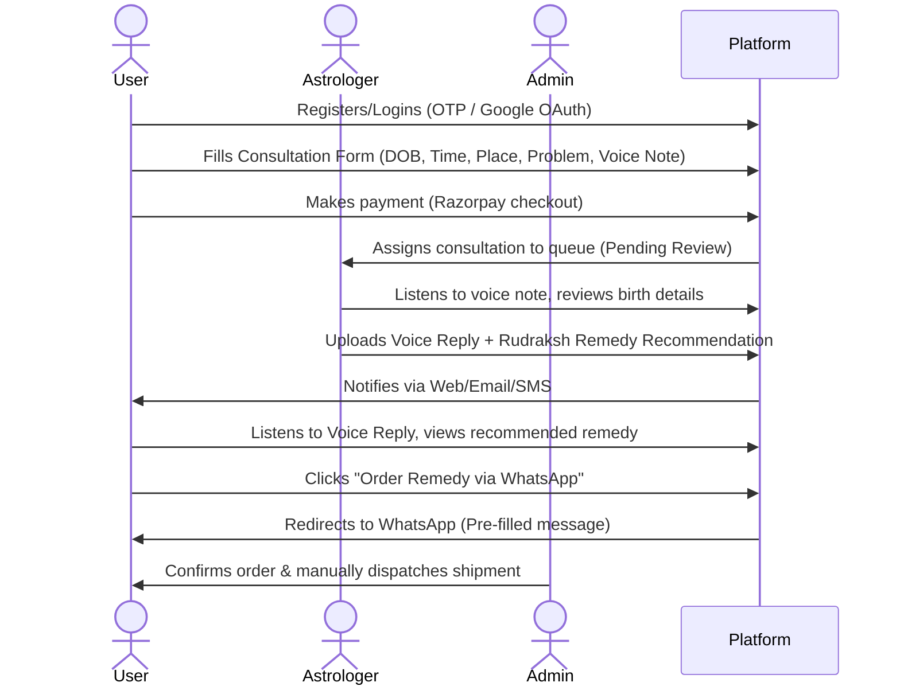

# Astrology Consultation Platform — Project Requirements

This document outlines the business, user, and functional requirements for the Astrology Consultation Platform (v1.0 MVP) based on the project documentation.

---

## 1. Project Overview & Vision
The Astrology Consultation Platform is a trust-first, production-ready web application designed for a rapid, low-cost launch (4–5 weeks timeline). The platform connects users with professional astrologers for voice-based personalized guidance and provides Rudraksh remedy recommendations that users can order.

### Business Workflow

---

## 2. Key Success Factors
*   **Fast Turnaround:** Consultation responses delivered within 24–48 hours (Critical).
*   **Client Trust:** Transparent process, genuine astrologers, real testimonials (Critical).
*   **Genuine Remedies:** Authentic Rudraksh and remedy products with quality guarantees (High).
*   **Voice Quality:** Clear, personalized, and empathetic voice replies (High).
*   **Simple UX:** Frictionless form → payment → response lifecycle (Medium).

---

## 3. User & System Roles
*   **User/Client:** Can register, submit consultations (date of birth, time, place, description, voice note), pay for consultations, track status, view astrologer replies, order remedies via WhatsApp, and submit reviews/testimonials.
*   **Astrologer:** Can view pending consultations, listen to user voice notes, upload voice replies, recommend remedies from the product inventory, and update consultation status.
*   **Admin:** Performs inventory management (remedy products/stock), review management (testimonials approval), order shipping status updates, and views overall platform stats.

---

## 4. Functional Requirements (MVP Scope)

### 4.1. Authentication & Profile
*   **OTP Login:** Secure passwordless authentication via mobile number using SMS OTP (via MSG91 or Twilio).
*   **Google Login:** OAuth2 social sign-in using Google accounts (handled by NextAuth.js on frontend, DRF social auth on backend).
*   **Profile Management:** User profile page to edit name, phone number, and upload a profile photo.

### 4.2. Consultation Lifecycle
*   **Consultation Intake Form:** Dynamic form capturing:
    *   Date of Birth (YYYY-MM-DD)
    *   Time of Birth (HH:MM)
    *   Place of Birth (City, Country)
    *   Problem Description (Text)
    *   Voice Note Upload (Audio file, max 10MB, MP3/WAV/OGG)
*   **Payment Gateway Integration:** Razorpay integration (INR currency).
    *   Consultation state is `pending` until Razorpay payment succeeds.
    *   Server-side signature verification is required before changing state to `paid`.
*   **Consultation Statuses:**
    *   `pending`: Awaiting payment.
    *   `paid`: Payment verified, awaiting astrologer review.
    *   `in_review`: Astrologer is currently reviewing.
    *   `replied`: Astrologer has uploaded voice reply and remedy recommendation.
    *   `closed`: Process completed.
*   **Voice Upload:** User voice notes and astrologer replies are stored securely in Cloudinary. Database stores only the Cloudinary CDN URLs.

### 4.3. Remedy Ordering & Inventory
*   **Inventory Catalog:** A managed list of Rudraksh beads and other remedies with stock tracking, descriptions, and pricing.
*   **Remedy Recommendation:** Astrologers can tag specific inventory products in their consultation reply.
*   **WhatsApp Ordering:** Generates a pre-filled `wa.me` WhatsApp link containing order details (product name, user ID, consultation reference) when a user clicks the order button.
*   **Order Tracking:** Basic status tracking for manual shipping: `received` → `packed` → `shipped` → `delivered`.

### 4.4. Admin & Astrologer Panel
*   **Dashboard Queue:** Lists pending consultations, showing quick statistics (total payments, pending reviews, active orders).
*   **Media Playback:** Integrated HTML5 audio player for listening to client voice notes directly in the admin dashboard.
*   **Consultation Response:** Interface for uploading the voice reply (audio) and tagging a remedy.
*   **Inventory Management:** Create, read, update, delete (CRUD) interface for remedy products and stock control.
*   **Review Management:** Interface to moderate and approve user-submitted reviews before they appear on the homepage/landing page.

---

## 5. Non-Functional & Architecture Requirements
*   **Security:** JWT-based session tokens. Environment secrets (Razorpay API keys, Cloudinary credentials, database passwords) must never be committed to Git. SSL/HTTPS must be enforced on all routes.
*   **Performance:** Next.js Server Components for landing pages and reviews. Caching and task-queues (Celery/Redis) for slow tasks like notifications and order status updates.
*   **Responsiveness:** Mobile-first layout (fully responsive) designed for users accessing the platform on mobile devices and checking status or playing audio files on the go.
